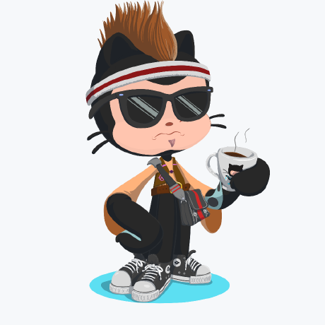

---
# Feel free to add content and custom Front Matter to this file.
# To modify the layout, see https://jekyllrb.com/docs/themes/#overriding-theme-defaults

layout: default
# layout: page
# layout: home
---

<!-- |I am text to the left|| -->

    

### Hey there, I'm Aravind 👋 

- 🎓 I'm a graduate student at Indian Institute of Science (IISc), specialising in Artificial Intelligence.
- 🔭 I’m currently working on Recommendation Systems and Adversarial Machine Learning.
- 🌱 I’m currently learning Natural Language Processing, Reinforcement Learning and Computer Vision.
- 👯 I’m looking to collaborate on interesting Machine Learning projects.
- 💬 Ask me about careers in AI, life at IISc or preparing for the GATE Exam.
- 📫 How to reach me: [Linkedin](https://www.linkedin.com/in/aravindgk/), [Twitter](https://twitter.com/aravind_IISc), [Quora](https://www.quora.com/profile/G-Aravind), [Email](mailto:aravindg1@iisc.ac.in).
