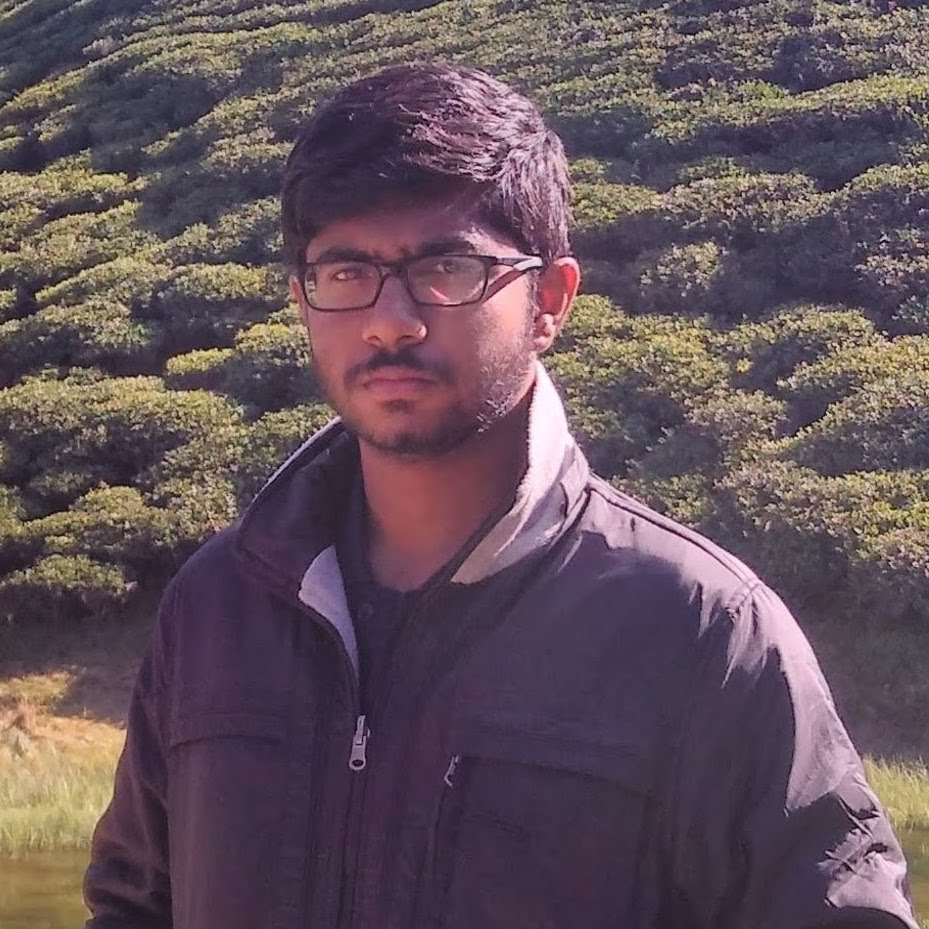

---
# Feel free to add content and custom Front Matter to this file.
# To modify the layout, see https://jekyllrb.com/docs/themes/#overriding-theme-defaults

layout: default
# layout: page
# layout: home
---

<link rel="preconnect" href="https://fonts.googleapis.com"> 
<link rel="preconnect" href="https://fonts.gstatic.com" crossorigin> 
<link href="https://fonts.googleapis.com/css2?family=Lora&display=swap" rel="stylesheet">

<!-- |I am text to the left|| -->

    

### Hey there, I'm Aravind 👋 

- 🔭 I work as a Data & Applied Scientist at Microsoft India.
- 🎓 Completed Master's in Artificial Intelligence from Indian Institute of Science (IISc), where I worked extensively on Recommendation Systems and Adversarial Machine Learning.
- 🌱 Also learning Natural Language Processing, Reinforcement Learning, Computer Vision and Scalable Systems.
- 👯 Looking to collaborate on interesting Machine Learning projects.
- 💬 Ask me about AI, life at IISc or preparing for the GATE Exam.
- 📫 How to reach me: <a href="https://www.linkedin.com/in/aravind-gk/" target="_blank" rel="noopener noreferrer">Linkedin</a>, <a href="https://twitter.com/aravind_IISc" target="_blank" rel="noopener noreferrer">Twitter</a>, <a href="https://www.quora.com/profile/G-Aravind" target="_blank" rel="noopener noreferrer">Quora</a>, <a href="https://myanimelist.net/profile/j-e-l-l-a-l" target="_blank" rel="noopener noreferrer">MyAnimeList</a>, <a href="mailto:g.aravind@hotmail.com" target="_blank">Email</a>.
